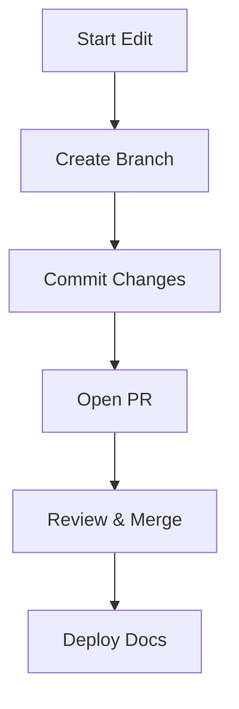

## Overview

dsds provides a powerful platform for managing your project documentation. You organize content into structured pages, track changes with version control, and collaborate seamlessly with your team. Master these core concepts to build efficient documentation workflows.

<Columns cols={3}>
  <Card title="Document Organization" icon="file-text" href="#document-organization">
    Structure your docs with folders, pages, and hierarchies for easy navigation.
  </Card>
  <Card title="Version Control" icon="git-branch" href="#version-control">
    Track changes, revert updates, and maintain history using integrated Git.
  </Card>
  <Card title="Collaboration" icon="users" href="#collaboration">
    Share edits, review changes, and merge contributions from multiple users.
  </Card>
</Columns>

## Document Organization

Organize your documentation into logical hierarchies. Create folders for categories like guides, APIs, and references. Each page supports rich MDX content with components for interactive experiences.

<Steps>
  <Step title="Create Folders" icon="folder">
    Navigate to your workspace and select **New Folder**. Name it based on your content category, such as `api-reference`.
  </Step>
  <Step title="Add Pages" icon="file">
    Inside a folder, create new MDX pages. Use frontmatter for metadata:
    
    ````mdx
    ```yaml
    ---
    title: API Endpoint
    description: Details for the user endpoint.
    ---
    ```
    ````
  </Step>
  <Step title="Link Pages" icon="link">
    Use relative links like `[Endpoint](/api-reference/user)` to connect related content.
  </Step>
</Steps>

<Callout kind="tip">
  Use consistent naming conventions, such as kebab-case for folders (`user-guide`), to improve searchability.
</Callout>

## Version Control Basics

dsds integrates Git for version control. You commit changes, create branches, and merge updates directly from the interface.

<CodeGroup tabs="Bash,CLI">
  ````bash
  git add docs/concepts.mdx
  git commit -m "Add core concepts page"
  git push origin main
  ````

  ````bash
  # From command line
  cd your-docs-repo
  git pull origin main
  git checkout -b feature/collaboration
  ````
</CodeGroup>

| Action          | Command Example                  | Purpose                          |
|-----------------|----------------------------------|----------------------------------|
| Commit changes  | `git commit -m "Update"`        | Save your local changes          |
| Create branch   | `git checkout -b new-feature`   | Isolate development work         |
| Merge branch    | `git merge feature-branch`      | Integrate changes to main        |

## Collaboration Features

Invite team members to collaborate. Assign roles like editor or viewer, and use pull requests for safe merges.

<Tabs>
  <Tab title="Editor Role" icon="edit-3">
    Editors modify content and create pull requests.
    
    ```bash
    git checkout -b fix/typo
    # Make edits to concepts.mdx
    git push origin fix/typo
    ```
  </Tab>
  <Tab title="Reviewer Role" icon="eye">
    Reviewers approve changes via the dsds interface.
    
    Review diffs, add comments, and merge.
  </Tab>
</Tabs>

<ExpandableGroup>
  <Expandable title="Advanced Permissions" default-open="false">
    Set granular permissions at the folder level. For example, restrict API docs to developers only.
    
    ```yaml
    permissions:
      - role: developer
        access: read-write
      - role: viewer
        access: read
    ```
  </Expandable>
</ExpandableGroup>



These concepts form the foundation of dsds. Apply them to streamline your documentation process and enhance team productivity.